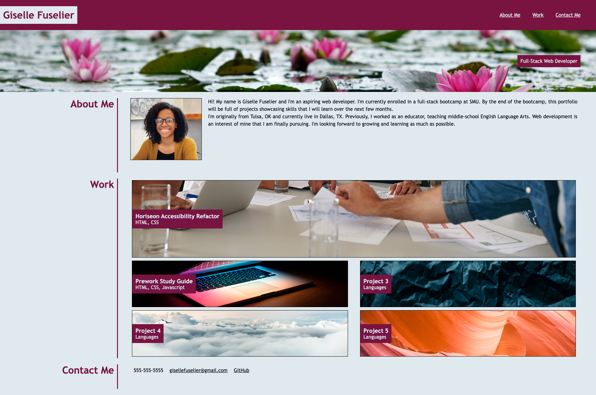

# Professional-Portfolio

## Description

I built this project as the first iteration of my professional developer portfolio. It includes About Me, Work, and Contact Me sections. The portfolio houses my current deployed web applications and I plan to add to it as I continue to make projects. I learned flexbox layouts to make my portfolio responsive across desktop and mobile devices. I also learned about media queries and css variables and used them to improve the style of my portfolio.

## Usage

Access my portfolio at [https://gfuselier.github.io/Professional-Portfolio](https://gfuselier.github.io/Professional-Portfolio)

## Credits
Image Attributions:

Lilypads - [Hanna Skoromna](https://unsplash.com/photos/SQ57KVVBnKE)
Laptop - [Joshua Reddekopp](https://unsplash.com/photos/SyYmXSDnJ54?utm_source=unsplash&utm_medium=referral&utm_content=creditCopyText)
Paper - [Alexander Grey](https://unsplash.com/photos/WqPAETBU2G8)
Clouds - [Dominik Schroder](https://unsplash.com/photos/FIKD9t5_5zQ)
Canyon - [Meric Dagli](https://unsplash.com/photos/5FluaSxz_UA)

README Guide: [https://coding-boot-camp.github.io/full-stack/github/professional-readme-guide](https://coding-boot-camp.github.io/full-stack/github/professional-readme-guide)   

## License

N/A
